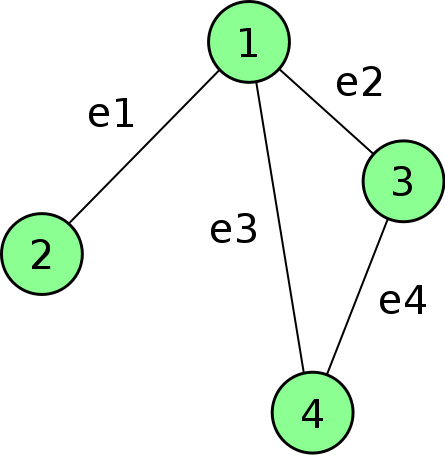

## 20190119 오답 정리

### 7번
* 연산자 표기법 (이기쥬히 요약본 p.10)
  * 전위 표기법 (prefix)
    * 연산자, 변수, 변수 순으로 구성
    * e.g. + 2 3
  * 중위 표기법 (infix)
    * 변수, 연산자, 변수 순으로 구성
    * e.g. 2 + 3
  * 후위 표기법 (postfix)
    * 변수, 변수, 연산자 순으로 구성
    * e.g. 2 3 +

### 6번
* 무방향 그래프
  * 그래프
    * 노드 (Node)와 간선 (Edge)으로 이루어진 자료구조 ([출처](https://gmlwjd9405.github.io/2018/08/13/data-structure-graph.html))
  * 무방향 그래프

      

    * 두 노드를 연결하는 간선의 방향이 없는 그래프 ([출처](https://m.blog.naver.com/PostView.nhn?blogId=k97b1114&logNo=140163248655&proxyReferer=https%3A%2F%2Fwww.google.com%2F))
    * 무방향 그래프의 간선을 최대로 가질 때는 모든 노드를 연결하는 경우로, 그때 간선 수는 n * (n - 1) / 2 (n개의 노드  수 가정) 

### 11번
* 해시 오버플로우 ([출처](https://preamtree.tistory.com/20))
  * 해시 테이블 (Hash Table)
    * 해시 함수를 이용
    * 키 (Key)와 값 (Value)을 갖는 자료구조
    * 검색 속도가 좋음
  * 해시 함수
    * 키 값으로 레코드가 저장되어 있는 주소 (혹은 색인)를 산출하는 함수
  * 해시 오버플로우
    * 다른 내용의 데이터가 같은 키를 갖는 경우
    * 성능을 떨어뜨림
  * 해시 오버플로우 해결 방법 ([출처](https://m.blog.naver.com/PostView.nhn?blogId=deepb1ue&logNo=221218479008&proxyReferer=https%3A%2F%2Fwww.google.com%2F))
    * 개방 주소법 (Open Addressing)
      * 선형 방법 (Linear Method)
      * 순차적으로 다음 빈 버킷을 찾아 저장
    * 폐쇄 주소법 (Close Addressing)
      * 오버플로우 영역에 오버플로우된 레코드를 저장하고 Chain (Pointer)로 홈 버킷에 연결
        * Direct Chaining
          * 해시표 내 빈 자리에 오버플로우 레코드 보관
        * Indirect Chaining 
          * 해시표와 별도의 기억공간에 오버플로우 레코드 보관
      * 재해싱 (Rehashing)
        * 새로운 해시 함수로 새로운 홈 주소를 구함

### 15번
* 트리 차수 vs level (depth) ([출처](https://jiwondh.github.io/2017/10/15/tree/))
  * 트리 ([출처](https://gmlwjd9405.github.io/2018/08/13/data-structure-graph.html))
    * 그래프 (특히 DAG (DirectedAcyclic Graph, 방향성이 있는 비순환 그래프))의 한 종류
  * 트리의 차수
    * 트리의 최대 차수
  * 노드의 차수
    * 하위 트리의 간선 수
  * 노드의 크기 (size)
    * **자신을 포함한 모든 자손 노드**의 개수
  * 노드의 깊이 (depth)
    * 루트 노드로부터 특정 노드에 도달하기 위해 거쳐야 하는 간선 수
  * 노드의 레벨 (level)
    * 트리의 특정 깊이를 가지는 노드의 집합

### 3번
* 해싱의 동의어 (Synonym) ([출처](https://raisonde.tistory.com/entry/%EB%8D%B0%EC%9D%B4%ED%84%B0%EB%B2%A0%EC%9D%B4%EC%8A%A4-%ED%95%B4%EC%8B%B1Hashing-%EA%B4%80%EB%A0%A8-%EC%9A%A9%EC%96%B4))
  * 충돌이 일어난 레코드의 집합
  * 키 값이 같은 레코드의 집합

### 8번, 16번
* 병행 제어 (동시성 제어) ([출처](http://www.jidum.com/jidums/view.do?jidumId=282))
  * 다중 사용자 환경 지원 데이터베이스 시스템에서 여러 트랜잭션이 동시에 성공적으로 실행될 수 있도록 지원하는 기술
  * 동시성 제어 기법의 종류
    * 로킹 기법
      * 트랜잭션이 사용하는 자원에 대해 상호배제 (Mutual Exclusion)기능 제공
      * 상호배제 (Mutual Exclusion) 
        * 특정 트랜잭션이 잠금 (Lock) 설정한 데이터를 해제 (Unlock)할 때까지 독점적으로 사용할 수 있는 것
      * 로킹 단위는 크기가 큰 순서대로 데이터베이스, 릴레이션 (파일), 튜플 (레코드), 속성 (필드)가 있음
      * 로킹 단위가 클수록
        * 구현이 용이
        * 동시성 약함
        * 로킹 오버헤드 감소
    * 타임스탬프 순서에 기반을 둔 동시성 제어 기법
      * 시스템에서 생성하는 고유 번호인 시간 스탬프를 트랜잭션에 부여해 트랜잭션 간 순서를 미리 선택
    * 다중버전 동시성 제어 기법
      * 트랜잭션이 데이터에 접근하려 할 때 해당 트랜잭션의 타임스탬프와 데이터의 타임스탬프들과 비교해, 현재 실행하는 스케쥴의 직렬 가능성을 보장하는 적절한 버전 선택해 접근
    * 검증 (낙관적) 동시성 제어 기법
      * 데이터베이스 연산 실행 이전에 검사를 수행하는 로킹, 타임스탬프 기법과 달리, 일단 트랜잭션을 수행하고 트랜잭션 종료 시 검증 수행