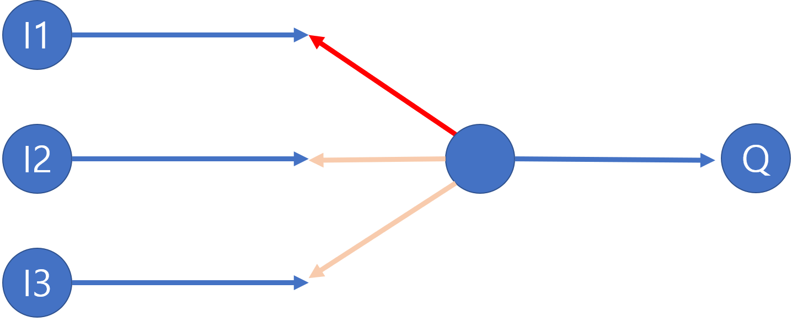
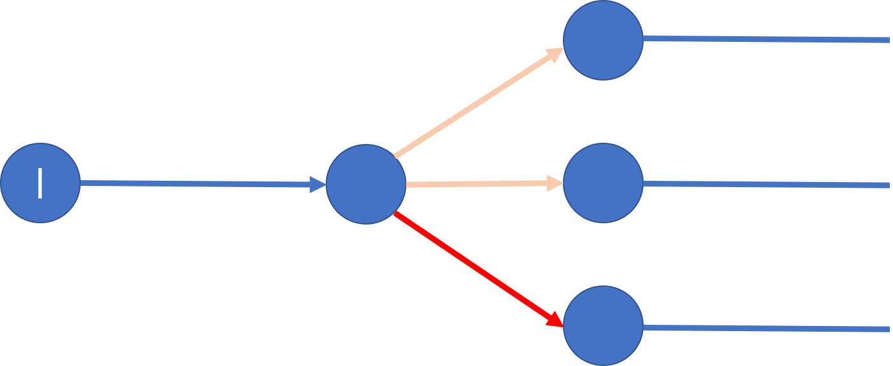

# 20190126 오답 정리
## 2018년 08월 19일 필기 기출문제

### 21번 마샬링 & 언마샬링
#### 마샬링
* 하나 이상의 프로그램 또는 연속되어 있지 않은 저장 공간으로부터 데이터 를 모은 다음, 데이터들을 메시지 버퍼에 집어넣고, 특정 수신기나 프로그래밍 인터페이스에 맞도록 그 데이터를 조직화하거나, 미리 정해진 다른 형식으로 변환하는 과정을 말한다.
* 객체의 메모리 구조를 저장이나 전송을 위해서 적당한 자료형태로 변형하는 것을 의미한다.
([출처](https://starblood.tistory.com/entry/Marshalling-vs-Serialization-마샬링-과-시리얼라이즈-의-차이))
* 보통 서로 다른 컴퓨터 혹은 서로 다른 프로그램 간에 데이터 이동되어야 할 때 사용된다.

#### 언마샬링
* 마샬링을 통해 보내진 데이터들을 원래 구조로 복원하는 것.

### 23번 멀티플렉서 & 디멀티플렉서
#### 멀티플렉서(Multiplexer)

* 여러 개의 입력 중 하나를 출력 하는 논리 회로
#### 디멀티플렉서(Demultiplexer)

* 하나의 입력 정보를 여러 개의 출력 장치 중 하나를 선택하여 정보를 전달하는 데 사용하는 것 ([출처](https://blog.naver.com/lagrange0115/220716574603))


### 25번 오퍼랜드 수에 따른 명령어 형식
| 오퍼랜드 수  | 특징                                | 장점                                                            | 단점                                                   |
| ------- | --------------------------------- | ------------------------------------------------------------- | ---------------------------------------------------- |
| 3 주소 명령 | 오퍼랜드 필드 부분이 3개인 명령어 형식            | 산술식을 프로그램화 하는 데 있어 프로그램 길이가 짧아짐                               | 수행기간이 길어진다.                                          |
| 2 주소 명령 | 가장 일반적으로 사용되는 명령어 형식              | 계산 결과가 기억장치에 기억되고 중앙처리장치에도 남아 있어 계산 결과를 시험할 필요가 있을때 시간이 절약된다. | 연산의 결과가 주로 operand 1에 저장되므로 원래의 자료가 파괴된다.            |
| 1 주소 명령 | 누산기(Accumulator)를 이용하여 명령어를 처리한다. |                                                               |                                                      |
| 0 주소 명령 | 모든 연산은 스택에 있는 자료를 이용하여 수행한다.      | 명령어의 길이가 매우 짧다.                                               | 특수한 경우를 제외하고는 많은 양의 정보가 스택과 기억장치 사이를 이동하게 되어 비효율적이다. |

#### 3 주소 명령 예시
``` 
*** 산술식 X = (A + B) * C 를 3-주소 명령어를 이용해 표현 ***

ADD A,B,R1 : R1 <- M(A) + M(B)
MUL R1,C,X : M(X) <- R1 * M(C)
```
* `Op-code | operand 1 | operand 2 | operand 3` 의 형식
* 위의 식에서 첫번째 줄의 의미는 A 위치와 B 위치를 더하여 R1에 더하라는 의미
* 두번째 줄의 의미는 R1 위치와 C 위치를 곱해 X 위치에 저장하라는 의미이다.

#### 2 주소 명령 예시
``` 
*** 산술식 X = (A + B) * C 를 2-주소 명령어를 이용해 표현 ***

MOVE A,R1 : R1 <- M(A)
ADD B,R1 : R1 <- R1 + M(B)
MUL C,R1 : R1 <- R1 * M(C)
MOVE R1,X : M(X) <- R1
```
* `Op-code | operand 1 | operand 2 ` 의 형식
* R1에 더하고 곱하면서 결과를 저장한뒤 원하는 결과를 최정적으로 X 위치에 옮김

#### 1 주소 명령 예시
``` 
*** 산술식 X = (A + B) * C 를 1-주소 명령어를 이용해 표현 ***

LOAD A : AC <- M(A)
ADD B : AC <- AC + M(B)
STORE X : M(X) <-AC
LOAD C : AD <- M(C)
MUL X : AC <- AC * M(X)
STORE X : M(X) <- AC
```
* AC : 누산기
* ADD B 에서 B를 더하는 결과가 AC에 저장된다고 약속됨

#### 0 주소 명령 예시
``` 
*** 산술식 X = (A + B) * C 를 0-주소 명령어를 이용해 표현 ***

PUSH A : TOS <- M(A)
PUSH B : TOS <- M(B)
ADD : TOS <- TOS + TOS-1 (A + B와 같음)
PUSH C : TOS <- M(C)
MUL : TOS <- TOS * TOS-1
POP X : M(X) <- TOS
```
* TOS : TOP OF STACK
* 0 주소 명령은 스택 구조를 이용한 계산 방식이다.

#### 참고 자료
-  https://jade314.tistory.com/entry/4-%EB%AA%85%EB%A0%B9%EC%96%B4%EC%9D%98-%ED%98%95%EC%8B%9D%EA%B3%BC-CPU%EA%B5%AC%EC%A1%B0
- http://ehpub.co.kr/tag/0%EC%A3%BC%EC%86%8C-%EB%AA%85%EB%A0%B9%EC%96%B40-address-instruction/
- https://newcom.tistory.com/entry/CHAPTRE5-%EB%AA%85%EB%A0%B9%EC%96%B4%EC%99%80-%EC%A3%BC%EC%86%8C%EC%A7%80%EC%A0%95%EB%B0%A9%EC%8B%9D


### 27번 BCD 코드 와 Excess-3 코드
#### BCD 코드
* BCD 코드는 Binary-coded decimal code라는 뜻
* 2진수를 이용해 10진수를 표현하는 것
* 10진수로 표기된 숫자의 각 자리수를 4bit의 2진수로 표현하는 방법
* 예시
  * 11 (10진수) -> 0001 0001 (2진수)
  * 28192 -> 0010 1000 0001 1001 0010

#### Excess-3 코드
* BCD 코드의 각 자리에 3(0011)을 더한 값
* 이렇게 각 자리수에 3을 더하게 되면 이를 2진수로 표현했을 때 각 비트값들을 반전시킬 경우 보수값이 나오게 됨
* 예를 들어 2를 반전시키면 8이 나오고 4를 반전시키면 6이 나옴
* 예시
  * 28192 (10진수) -> 0101 1011 0100 1100 0101


### 28번 Polling vs Interrupt
#### Polling(폴링)
* CPU가 일정한 시간 간격을 두고 각 자원들의 상태를 주기적으로 확인하는 방식
* 주기적으로 체크만 하면 되기 때문에 커널과 같은 Interrupt Handler가 필요하지 않음.
* 시스템 리소스를 많이 먹는 부분에 구현시 시스템 성능 저하의 원인이 되기도 함
* 정확한 타이밍을 요하는 곳에서 사용시 문제 발생의 원인이 될 수 있음.

#### Interrupt(인터럽트)
* 하드웨어에서 지정한 시그널을 받도록 구현하는 방식
* 커널의 Interrupt Handler가 Interrupt를 체크하며, 발생시에는 Interrupt Thread로 Interrupt 발생을 알려줌
* Polling보다 구현이 복잡함
* 풀링과 달리 정확한 타이밍을 요하는 드라이버에 적합함
* Interrupt 발생 이벤트가 들어올 때만 드라이버에서 처리하기 때문에 시스템 부하를 줄일 수 있음.


### 31번 Addressing Mode(주소지정 방식) ([출처](!https://skagh.tistory.com/8))
#### Immediate Addressing 즉시 주소 지정 방식

* Operand가 Instruction에 포함된다.
  * Insturction : 컴퓨터 명령어. 연산(OP Code), 주소 결정 방식(Mode), 주소 필드(Operand)로 구성되어 있음
* 빠르다는 장점이 있다.
* 단점으로는 수의 크기에 제한이 있다.

#### Direct Addressing 직접 주소 지정 방식

* Instruction에 Operand의 주소가 들어간다.
* 주소값이 있기 때문에 메모리에 한번 접근해야 할 필요가 있다.
* 단점으로는 주소공간이 제한된다.

#### Indirect Addressing 간접 주소 지정 방식

* Instruction에 Operand의 주소 값을 가지는 곳의 주소가 들어간다.
* 주소 값을 가지는 곳을 접근한 뒤 다시 한번 주소값을 통해 접근해야 Operand를 알 수 있다.(2번의 메모리 접근이 필요)

#### register addressing 레지스터 주소 지정

* 직접 주소 지정 방식과 유사하지만 주소 값이 메모리가 아닌 레지스터를 가리킨다.
* 장점으로 명령어의 주소필드가 작아도 된다. 메모리 접근이 없다. 매우 빠르다
* 단점으로 레지스터 개수에 제한이 있다.

#### register Indirect Addressing 레지스터 간접 주소 지정 방식

* 간접 주소 방식과 유사하다.
* 주소필드가 register를 가리키고 레지스터는 메모리의 Operand의 주소값을 가리킨다.
* 장점으로 넓은 주소 공간을 가지고 한번의 메모리 접근만 하면 된다.

#### Displacement Addressing 변위 주소 지정 방식

* 총 3가지 방식이 있다.

##### Relative addressing 상대 주소 지정
* PC(Program Counter) 값에 명령어의 주소 필드의 값을 더해서 유효 주소를 구한다.
* 지역성 때문에 현재 실행되는 명령어와 인접한 명령들이 주로 실행하면 주소 비트를 절약할 수 있다.

##### Base-Register Addressing 베이스-레지스터 주소 지정
* 베이스 레지스터의 값과 주소 필드의 변위 값을 더해서 유효주소를 구한다.

##### Indexed Addressing 인덱싱
* 레지스터는 변위 값을 가지며, 주소 필드는 메모리 주소를 가지고 있다.

이미지 출처: https://skagh.tistory.com/8 [재수강은없다]

#### Stack addressing 스택 주소 지정
* 명령어가 동작 코드로만 이루어지며 주소부는 묵시적으로 스택 레지스터 최상위 값(스택 포인터)이 됨
* 레지스터 주소 지정 방식이면서 생략 주소 표현 방식을 취함

#### 참고 자료
* https://skagh.tistory.com/8
* https://blog.naver.com/k97b1114/140157844146
* http://blog.naver.com/gr25554/220661797416


### 29번 프로세서 종류
#### 배열 프로세서
* 대규모의 데이터 배열에 대한 계산을 수행하는 프로세서
* 데이터를 고속으로 처리하기 위해 연산 장치를 병렬로 구성한 처리 구조로 벡터 계산이나 행렬 계산에 주로 사용되는 프로세서

#### 코프로세서
* CPU의 기능을 보충하기 위해 사용되는 컴퓨터 프로세서

### 33번 Programmable Logic Array (PLA)
* PLD(프로그램 가능 논리 소자)의 한 종류
* AND와 OR 게이트 모두를 프로그램이 가능함.


### 34번 레지스터
* 레지스터는 CPU내부에 존재하는 다목적 저장 공간
* CPU와 한 몸이기 때문에 고속으로 데이터 처리가 가능

#### 범용 레지스터 (General Purpose Register)
* 중앙처리장치가 처리하는 작은 데이터의 임시저장 공간
* 연산처리 및 번지지정을 도와줌
* 기억장치 주소를 저장한다.

#### 상용 레지스터
* 마이크로프로세서에서 다양한 산술 연산 결과의 상태를 알려주는 플래그 비트들이 모인 레지스터
* 주로 조건문과 같은 실행 순서의 분기에 사용된다.

| 플래그 기호    | 이름       | 의미                                    |
| --------- | -------- | ------------------------------------- |
| Z         | 제로 플래그   | 연산 결과가 0일 경우에 참이 된다.                  |
| S         | 사인 플래그   | 연산 결과가 음수일 때 참이 된다.                   |
| C         | 캐리 플래그   | 부호 없는 숫자의 연산 결과가 비트 범위를 넘어섰을 때 참이 된다. |
| V / O / W | 오버플로 플래그 | 부호 있는 숫자의 연산 결과가 비트 범위를 넘어섰을 때 참이 된다. |

출처 : https://ko.wikipedia.org/wiki/%EC%83%81%ED%83%9C_%EB%A0%88%EC%A7%80%EC%8A%A4%ED%84%B0 [위키피디아 상태 레지스터]

### 상호배제(Mutual exclusion)
* 상호 배제는 프로그램들이 공유 자원을 동시에 쓸 수 없는 상황을 일컫는다.
* ....